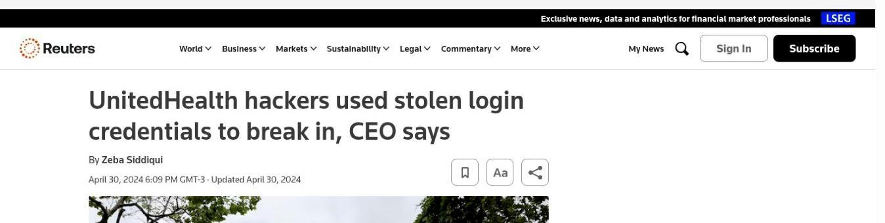
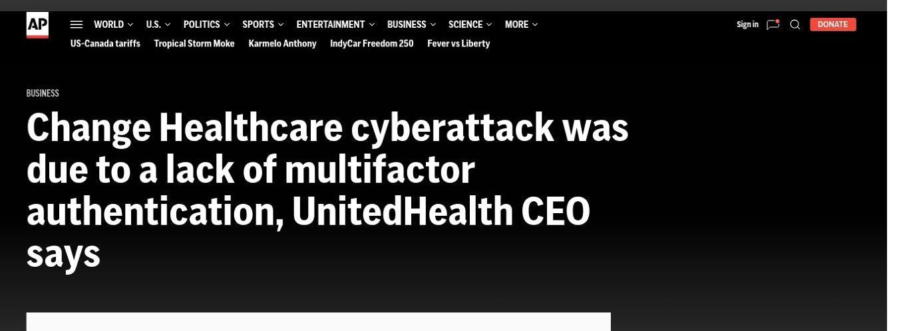
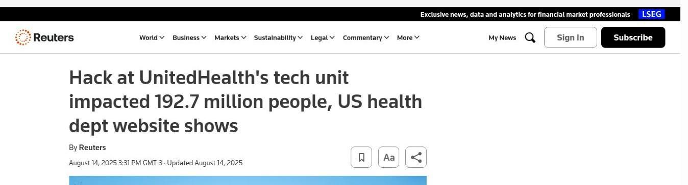

# Análise do ataque de ransomware à Change Healthcare (2024)

Estudo de caso em cibersegurança desenvolvido a partir de uma atividade proposta pelo programa Mulher Digital.

Este repositório reúne uma investigação estudantil baseada em fontes públicas sobre o ataque de ransomware que afetou a Change Healthcare em 2024. O objetivo foi compreender o que aconteceu, observar os impactos sobre a organização e os serviços de saúde e relacionar o caso aos fundamentos de segurança, continuidade e resposta a incidentes.

## Documento completo

[Acesse a análise completa em PDF](<Análise do ataque de ransomware à Change Healthcare (2024).pdf>).

O PDF foi incluído no repositório sem alterações em relação à versão final revisada.

## Resumo da investigação

Em 12 de fevereiro de 2024, agentes não autorizados acessaram um portal Citrix da Change Healthcare com credenciais comprometidas. O portal não utilizava autenticação multifator (MFA). Em 21 de fevereiro, o grupo ALPHV/BlackCat executou o ransomware, e a UnitedHealth Group desconectou os sistemas afetados como medida de contenção.

As fontes consultadas confirmam o uso de credenciais comprometidas, mas não explicam como elas foram obtidas. Por isso, phishing, malware, reutilização de senha ou exploração de alguma vulnerabilidade não são apresentados como causas confirmadas do acesso inicial.

O incidente afetou principalmente dois princípios da segurança da informação:

- **Confidencialidade:** dados pessoais e de saúde foram retirados do ambiente. O HHS consolidou posteriormente o total de 192,7 milhões de pessoas afetadas.
- **Disponibilidade:** serviços de prescrição, autorização, faturamento, processamento de solicitações e pagamentos ficaram indisponíveis, atingindo hospitais, farmácias, consultórios e outros prestadores.

A posição central da Change Healthcare ampliou o impacto. A interrupção de uma única plataforma alcançou muitas organizações que dependiam dela para atividades administrativas e financeiras relacionadas ao atendimento em saúde.

## Resposta ao incidente

Com base nas informações públicas encontradas, a resposta incluiu:

- isolamento dos ambientes afetados e interrupção da conectividade;
- participação de autoridades e especialistas externos;
- reconstrução e restauração gradual dos serviços;
- criação de apoio financeiro temporário para prestadores afetados;
- comunicação pública, atendimento às pessoas afetadas e notificações sobre a exposição de dados;
- monitoramento posterior e análise dos arquivos retirados;
- confirmação do pagamento de aproximadamente US$ 22 milhões em resgate.

Mandiant e Palo Alto Networks foram citadas entre as empresas que participaram da resposta. Os produtos específicos utilizados não foram divulgados. No estudo completo, Splunk e CrowdStrike Falcon aparecem apenas como exemplos de ferramentas que poderiam apoiar uma situação semelhante, e não como tecnologias confirmadas neste incidente.

## Análise e reforço da proteção

O caso mostra que um controle básico pode ter grande importância quando protege um serviço de acesso remoto. Ao mesmo tempo, a análise não reduz o incidente à ausência de MFA. A proteção depende de controles que funcionem em conjunto:

- MFA em acessos remotos e contas sensíveis;
- privilégio mínimo e revisão periódica de contas;
- centralização de logs e monitoramento com SIEM;
- alertas para acessos e transferências de dados incomuns;
- segmentação de rede;
- backups protegidos e testes de restauração;
- gestão de vulnerabilidades;
- avaliação de fornecedores críticos;
- planos, exercícios e comunicação para resposta a incidentes.

De acordo com os dados públicos encontrados, podemos pensar que a janela de nove dias entre o primeiro acesso e a execução do ransomware poderia ter produzido sinais de atividade incomum. As fontes, porém, não apresentam os registros internos necessários para afirmar quais alertas existiram ou como foram tratados.

## Uma comparação a partir do Brasil

O PDF também apresenta uma comparação de contexto com o apagão tecnológico global de julho de 2024, que afetou instituições de saúde em São Paulo. Esse acontecimento não teve relação com o ransomware da Change Healthcare. A comparação foi incluída apenas para mostrar, a partir de uma situação mais próxima da realidade brasileira, como a dependência de sistemas e fornecedores pode alcançar o atendimento e a comunicação com pacientes.

## Evidências jornalísticas

As imagens abaixo registram os cabeçalhos das notícias utilizadas na pesquisa. Os recortes identificam a fonte, o título e a data sem reproduzir o conteúdo integral das reportagens.

### Credenciais comprometidas como vetor de acesso

Fonte: Reuters, 30 abr. 2024.

### Ausência de autenticação multifator

Fonte: Associated Press, 1 maio 2024.

### Total consolidado de pessoas afetadas

Fonte: Reuters, 14 ago. 2025.

## Referências utilizadas

### Fontes oficiais e institucionais

- [American Hospital Association - pesquisa sobre os impactos nos hospitais](https://www.aha.org/2024-03-15-aha-survey-change-healthcare-cyberattack-significantly-disrupts-patient-care-hospitals-finances)
- [UnitedHealth Group - atualização de 7 de março de 2024](https://www.unitedhealthgroup.com/newsroom/2024/2024-03-07-uhg-update-change-healthcare-cyberattack.html)
- [UnitedHealth Group - atualização de 18 de março de 2024](https://www.unitedhealthgroup.com/newsroom/2024/2024-03-18-uhg-cyberattack-status-update.html)
- [UnitedHealth Group - atualização de 22 de abril de 2024](https://www.unitedhealthgroup.com/newsroom/2024/2024-04-22-uhg-updates-on-changehealthcare-cyberattack.html)
- [UnitedHealth Group - resultados do primeiro trimestre de 2024](https://www.sec.gov/Archives/edgar/data/731766/000073176624000146/a2024q1exhibit991.htm)
- [HHS - perguntas frequentes sobre o incidente](https://www.hhs.gov/hipaa/for-professionals/special-topics/change-healthcare-cybersecurity-incident-frequently-asked-questions/index.html)
- [SEC - comunicado da UnitedHealth Group sobre o incidente](https://www.sec.gov/Archives/edgar/data/731766/000073176624000045/unh-20240221.htm)
- [Senado dos Estados Unidos - audiência sobre o ataque](https://www.finance.senate.gov/hearings/hacking-americas-health-care-assessing-the-change-healthcare-cyber-attack-and-whats-next)

### Reportagens e fontes de contexto

- [Associated Press - impacto inicial em farmácias e hospitais](https://apnews.com/article/change-cyberattack-hospitals-pharmacy-alphv-unitedhealthcare-521347eb9e8490dad695a7824ed11c41)
- [Associated Press - ausência de autenticação multifator](https://apnews.com/article/change-healthcare-cyberattack-unitedhealth-senate-9e2fff70ce4f93566043210bdd347a1f)
- [Forbes - interrupção de serviços após o ataque](https://www.forbes.com/sites/mollybohannon/2024/02/23/change-healthcare-cyberattack-disrupts-services-nationwide-heres-what-to-know/)
- [CNN - investigação sobre a proteção dos dados de pacientes](https://edition.cnn.com/2024/03/13/politics/feds-investigating-whether-hacked-health-care-giant-complied-with-law-protecting-patient-data)
- [CNN - avanço da recuperação e impacto sobre pequenas clínicas](https://edition.cnn.com/2024/03/18/tech/health-insurance-billing-system-cyberattack)
- [CNN - estimativa inicial sobre o alcance da exposição de dados](https://edition.cnn.com/2024/05/01/politics/data-stolen-healthcare-hack)
- [CNN Brasil - impacto de outro apagão tecnológico em serviços de saúde brasileiros](https://www.cnnbrasil.com.br/nacional/apagao-cibernetico-global-impacta-servicos-de-saude-brasileiros-entenda/)
- [Reuters - credenciais comprometidas como vetor de acesso](https://www.reuters.com/technology/cybersecurity/unitedhealth-hackers-took-advantage-citrix-vulnerabilty-break-ceo-says-2024-04-29/)
- [Reuters - total consolidado de 192,7 milhões de pessoas afetadas](https://www.reuters.com/business/hack-unitedhealths-tech-unit-impacted-1927-million-people-us-health-dept-website-2025-08-14/)
- [Wikipedia - contexto geral sobre a Change Healthcare](https://en.wikipedia.org/wiki/Change_Healthcare)

As referências completas, formatadas para o trabalho, estão disponíveis no final do PDF.

## Autoria

**Cecilia Nogueira**  
Estudante de Cibersegurança e participante do programa Mulher Digital.
